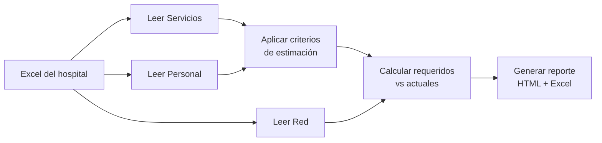

<div align="center">

# 🖥️ Calculadora de Infraestructura EDS

### IMSS-Bienestar — Estimación automática de equipamiento tecnológico para unidades médicas

[]()
[]()
[]()
[]()
[]()

<br>


</div>

---

## 📋 ¿Qué hace esta herramienta?

Toma el Excel con los datos de tu hospital y **calcula automáticamente** cuánto equipo de cómputo, impresoras, access points y switches se necesitan, aplicando los criterios oficiales del IMSS-Bienestar.

<table>
<tr>
<td align="center">📤</td>
<td align="center">⚙️</td>
<td align="center">📊</td>
<td align="center">📥</td>
</tr>
<tr>
<td align="center"><b>Subes tu Excel</b><br><small>con los datos del hospital</small></td>
<td align="center"><b>Procesamos</b><br><small>aplicando criterios oficiales</small></td>
<td align="center"><b>Generamos reporte</b><br><small>HTML + Excel actualizado</small></td>
<td align="center"><b>Descargas</b><br><small>los resultados</small></td>
</tr>
</table>

<br>

## 🚀 Usar la app web (recomendado)

La forma más sencilla. Solo abre el navegador:

```
https://calculainfra.up.railway.app
```

1. **Sube** tu archivo Excel
2. **Presiona** "Procesar archivo"
3. **Revisa** el reporte visual
4. **Descarga** el Excel actualizado

> ⚡ Todo se procesa en memoria — **no se guarda ningún archivo** en el servidor.

<br>

## 🐍 Usar desde la terminal

```bash
pip install -r requirements.txt
python calcular_infraestructura.py --archivo "mi_hospital.xlsx"
```

Opciones disponibles:

| Flag | Descripción |
|---|---|
| `--archivo "archivo.xlsx"` | Ruta al Excel (default: `Información implementación EDS UM.xlsx`) |
| `--actualizar-excel` | Escribe los faltantes en la hoja Red |
| `--generar-html` | Genera un reporte visual HTML |
| `--comp-req N` | Sobrescribe total de computadoras requeridas |
| `--imp-req N` | Sobrescribe total de impresoras requeridas |
| `--ap-req N` | Sobrescribe total de access points requeridos |
| `--sw24-req N` | Sobrescribe total de switches requeridos |

<br>

## 🏗️ Estructura del proyecto

```
calculainfra/
├── app.py                          # Aplicación web Flask
├── calcular_infraestructura.py     # Motor de cálculo
├── requirements.txt                # Dependencias
├── Procfile                        # Configuración de deploy
├── .gitignore
├── templates/
│   ├── index.html                  # Formulario de carga
│   └── reporte.html                # Vista del reporte
└── README.md
```

<br>

## 📐 Criterios de estimación

### Equipos de cómputo (criterios oficiales IMSS-Bienestar)

| Servicio | Área | Fórmula |
|---|---|---|
| **Urgencias** | Admisión / Triage | 1 por módulo |
| | Consultorios | 1 por consultorio |
| | Camas | 1 cada 5 camas |
| | Central de enfermería | 1 por central |
| **Hospitalización** | Camas (incluye UCIA, UCIP, UCIN) | 1 cada 5 camas |
| | Central de enfermería | 1 por central |
| | Farmacia hospitalaria | 1 por área |
| **Quirófano** | Salas | 1 cada 2 salas |
| **Tococirugía** | Salas de expulsión | 1 cada 2 salas |
| | Camas labor/recuperación | 1 cada 5 camas |
| **Consulta externa** | Consultorios | 1 por consultorio |
| | Especialidades | 1 por consultorio |
| **Cuerpo de gobierno** | Dirección, jefaturas, etc. | 1 por perfil con personal |

### Red (criterios técnicos)

| Equipo | Criterio |
|---|---|
| 🖨️ **Impresoras** | 1 cada 10 equipos de cómputo |
| 📡 **Access Point** | 1 cada 25 dispositivos |
| 🔌 **Switch 24p** | 1 cada 22 nodos (24 puertos - 2 uplink) |

<br>

## ⚙️ ¿Cómo funciona internamente?



1. **Lee** las pestañas `Servicios`, `Personal` y `Red` del Excel
2. **Aplica** las reglas de estimación (equipos por cama, consultorio, etc.)
3. **Compara** lo requerido contra lo que ya existe
4. **Calcula** APs y Switches según dispositivos totales
5. **Genera** un reporte HTML interactivo y un Excel actualizado

<br>

## 🛠️ Tecnologías

<p align="center">
  
  
  
  
  
  
</p>

<br>

## 🤝 Contribuir

¿Quieres aportar? ¡Genial!

1. Haz un fork del proyecto
2. Crea una rama: `git checkout -b feature/mi-idea`
3. Haz tus cambios: `git commit -m "Agrego X"`
4. Sube la rama: `git push origin feature/mi-idea`
5. Abre un Pull Request a la rama `develop`

<br>

---

<div align="center">
  <sub>Hecho con ❤️ para el IMSS-Bienestar · EDS · Expediente Digital de Salud</sub>
  <br>
  <sub>¿Preguntas? Abre un <a href="https://github.com/carlosalberto-maker/calculainfra/issues">issue</a></sub>
  <br><br>
  
</div>
